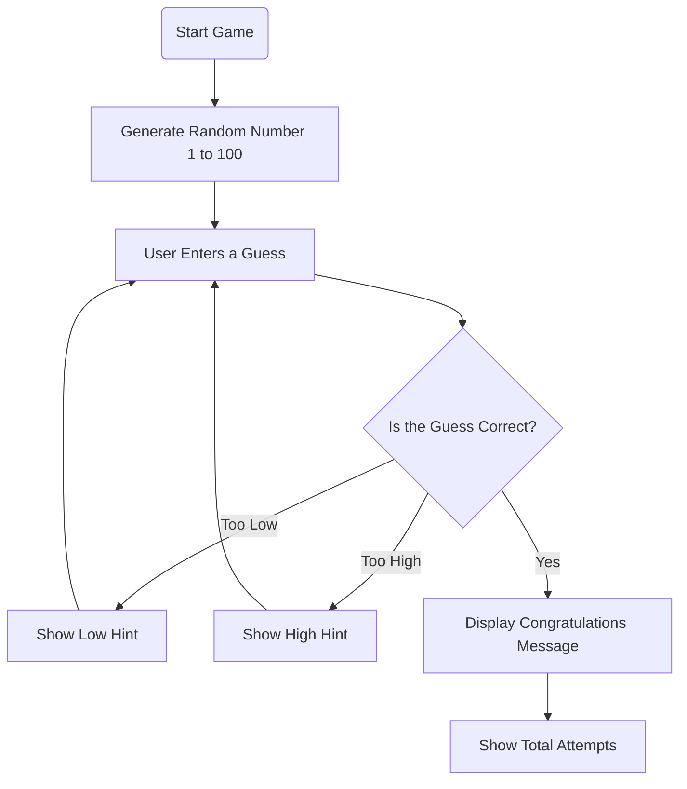

# 🎯 Number Guessing Game GUI


A simple and interactive **Number Guessing Game** built using **Python and Tkinter**.  
The computer generates a random number between **1 and 100**, and the player has to guess the correct number with the help of hints.

---

## 📌 Project Overview

This project provides a graphical user interface where users can enter their guesses and receive instant feedback.

- 📉 Shows a message if the guessed number is too low.
- 📈 Shows a message if the guessed number is too high.
- 🎉 Congratulates the player after the correct guess.
- 🔢 Tracks the number of attempts taken to win the game.

---

## 🖥️ Project Preview

```
+--------------------------------+
|      🎯 Number Guessing Game    |
|                                |
|       Guess Number (1-100)     |
|                                |
|          [  Enter Number ]     |
|                                |
|            [ Check ]           |
|                                |
|       Your guess is too low    |
|                                |
+--------------------------------+
```

---

## 🛠️ Technologies Used

| Technology | Purpose |
|------------|---------|
| 🐍 Python | Core programming language |
| 🖼️ Tkinter | Building graphical user interface |
| 🎲 Random Module | Generating random numbers |

---

## 🔄 Game Flow Diagram



---

## 📂 Project Structure

```
Number-Guessing-Game/
│
├── game.py        # Main Python code
├── README.md      # Project documentation
```

---

## ⚙️ Installation & Running

### 1️⃣ Clone the repository

```bash
git clone https://github.com/your-username/Number-Guessing-Game.git
```

### 2️⃣ Navigate to project folder

```bash
cd Number-Guessing-Game
```

### 3️⃣ Run the Python file

```bash
python game.py
```

---

## 🧠 How It Works

1. The game starts by generating a secret random number.
2. The player enters a number using the GUI.
3. The program compares the guess with the secret number.
4. The game provides hints:
   - 📉 Too Low
   - 📈 Too High
5. The process repeats until the player guesses correctly.
6. The total number of attempts is displayed.

---

## 🚀 Future Improvements

- 🔄 Add a "Play Again" button.
- 🎨 Improve GUI with better styling.
- ⏳ Add a timer feature.
- 🏆 Add difficulty levels.
- 💾 Store high scores.

---

## 👩‍💻 Author

Developed with ❤️ using Python and Tkinter.

⭐ If you liked this project, consider giving it a star on GitHub!
